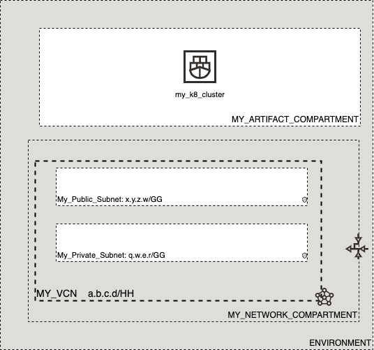

# OCI Cloud Bricks: Oracle Container (Kubernetes) Engine (OKE) - Cluster

[](https://img.shields.io/badge/license-UPL-green) [](https://sonarcloud.io/dashboard?id=oracle-devrel_terraform-oci-cloudbricks-oke-cluster)

## Introduction
The following cloud brick enables you to create a decoupled Oracle Kubernetes Engine Cluster associated to a particular compartment and subnets

## Reference Architecture
The following is the reference architecture associated to this brick



In this case, you can take advantage of the decoupled nature of the network compartment and the artifact compartment for cost tracking purposes. 


### Prerequisites
- Pre existent Compartment structure
- Pre existent VCN and Subnets

## Sample tfvar file
```shell
########## SAMPLE TFVAR FILE ##########
########## PROVIDER SPECIFIC VARIABLES ##########
region           = "foo-region-1"
tenancy_ocid     = "ocid1.tenancy.oc1..abcdefg"
user_ocid        = "ocid1.user.oc1..aaaaaaabcdefg"
fingerprint      = "fo:oo:ba:ar:ba:ar"
private_key_path = "/absolute/path/to/api/key/your_api_key.pem"
########## PROVIDER SPECIFIC VARIABLES ##########

########## ARTIFACT SPECIFIC VARIABLES ##########
oke_instance_compartment_name     = "MY_ARTIFACT_COMPARTMENT"
oke_network_compartment_name      = "MY_NETWORK_COMPARTMENT"
oke_vcn_display_name              = "MY_VCN"
oke_lbaas_network_subnet_name     = "My_Public_Subnet"
oke_endpoint_subnet_name          = "My_Public_Subnet"
oke_endpoint_is_public_ip_enabled = true
oke_availability_domain_map       = { "ad1" : "aBCD:foo-REGION-1-AD-1", "ad2" : "aBCD:foo-REGION-1-AD-2" , "ad2" : "aBCD:foo-REGION-1-AD-3" }
cluster_name                      = "my_k8_cluster"
k8s_version                       = "vX.Y.Z"
k8s_dashboard_enabled             = true
k8s_tiller_enabled                = true
########## ARTIFACT SPECIFIC VARIABLES ##########
########## SAMPLE TFVAR FILE ##########
```

### Variable specific considerations
- Different compartments for both Network and Artifact can be used. These can be the same as well. Provide it's corresponding Display Name in the corresponding variables `oke_instance_compartment_name` and `oke_network_compartment_name` 
- The OKE Cluster Control Plane, can be either public or private. In order to make it public, ise the variable `oke_endpoint_is_public_ip_enabled` to `true` and use a public subnet under variable `oke_endpoint_subnet_name`
- Is possible to use as many AD as are available on the region currently in use. These can be passed on separated by commas and enclosed by double quotes as above example
- The cluster version can be determined by the [following link](https://docs.oracle.com/en-us/iaas/Content/ContEng/Concepts/contengaboutk8sversions.htm)
- If Dashboard is required upon creation set the variable `k8s_dashboard_enabled` to `true`
- If Tiller is required upon creation set the variable `k8s_tiller_enabled` to `true`
  
---

## Sample provider
The following is the base provider definition to be used with this module

```shell
terraform {
  required_version = ">= 0.13.5"
}
provider "oci" {
  region       = var.region
  tenancy_ocid = var.tenancy_ocid
  user_ocid        = var.user_ocid
  fingerprint      = var.fingerprint
  private_key_path = var.private_key_path
  disable_auto_retries = "true"
}

provider "oci" {
  alias        = "home"
  region       = data.oci_identity_region_subscriptions.home_region_subscriptions.region_subscriptions[0].region_name
  tenancy_ocid = var.tenancy_ocid  
  user_ocid        = var.user_ocid
  fingerprint      = var.fingerprint
  private_key_path = var.private_key_path
  disable_auto_retries = "true"
}
```
---

## Variable documentation
## Requirements

| Name | Version |
|------|---------|
| <a name="requirement_terraform"></a> [terraform](#requirement\_terraform) | >= 0.13.5 |

## Providers

| Name | Version |
|------|---------|
| <a name="provider_oci"></a> [oci](#provider\_oci) | 4.35.0 |
| <a name="provider_oci.home"></a> [oci.home](#provider\_oci.home) | 4.35.0 |
| <a name="provider_random"></a> [random](#provider\_random) | 3.1.0 |

## Modules

No modules.

## Resources

| Name | Type |
|------|------|
| [oci_containerengine_cluster.oke_cluster](https://registry.terraform.io/providers/hashicorp/oci/latest/docs/resources/containerengine_cluster) | resource |
| [oci_identity_tag.release](https://registry.terraform.io/providers/hashicorp/oci/latest/docs/resources/identity_tag) | resource |
| [oci_identity_tag_namespace.devrel](https://registry.terraform.io/providers/hashicorp/oci/latest/docs/resources/identity_tag_namespace) | resource |
| [random_id.tag](https://registry.terraform.io/providers/hashicorp/random/latest/docs/resources/id) | resource |
| [oci_core_subnets.ENDPOINTSUBNET](https://registry.terraform.io/providers/hashicorp/oci/latest/docs/data-sources/core_subnets) | data source |
| [oci_core_subnets.LBAASSUBNET](https://registry.terraform.io/providers/hashicorp/oci/latest/docs/data-sources/core_subnets) | data source |
| [oci_core_vcns.VCN](https://registry.terraform.io/providers/hashicorp/oci/latest/docs/data-sources/core_vcns) | data source |
| [oci_identity_compartments.COMPARTMENTS](https://registry.terraform.io/providers/hashicorp/oci/latest/docs/data-sources/identity_compartments) | data source |
| [oci_identity_compartments.NWCOMPARTMENTS](https://registry.terraform.io/providers/hashicorp/oci/latest/docs/data-sources/identity_compartments) | data source |
| [oci_identity_region_subscriptions.home_region_subscriptions](https://registry.terraform.io/providers/hashicorp/oci/latest/docs/data-sources/identity_region_subscriptions) | data source |

## Inputs

| Name | Description | Type | Default | Required |
|------|-------------|------|---------|:--------:|
| <a name="input_cluster_name"></a> [cluster\_name](#input\_cluster\_name) | Defines the K8 Cluster Name | `any` | n/a | yes |
| <a name="input_fingerprint"></a> [fingerprint](#input\_fingerprint) | API Key Fingerprint for user\_ocid derived from public API Key imported in OCI User config | `any` | n/a | yes |
| <a name="input_k8s_dashboard_enabled"></a> [k8s\_dashboard\_enabled](#input\_k8s\_dashboard\_enabled) | Defines if Kubernetes Dashboard is enabled for cluster | `bool` | `false` | no |
| <a name="input_k8s_tiller_enabled"></a> [k8s\_tiller\_enabled](#input\_k8s\_tiller\_enabled) | Defines if Helm (Tiller) is enabled in cluster | `bool` | `false` | no |
| <a name="input_k8s_version"></a> [k8s\_version](#input\_k8s\_version) | Declares K8 Version | `any` | n/a | yes |
| <a name="input_oke_availability_domain_map"></a> [oke\_availability\_domain\_map](#input\_oke\_availability\_domain\_map) | The name of the availability domain in which this node is placed | `map(any)` | n/a | yes |
| <a name="input_oke_endpoint_is_public_ip_enabled"></a> [oke\_endpoint\_is\_public\_ip\_enabled](#input\_oke\_endpoint\_is\_public\_ip\_enabled) | Determines if OKE Control Plane is located on public or private subnet | `any` | n/a | yes |
| <a name="input_oke_endpoint_subnet_name"></a> [oke\_endpoint\_subnet\_name](#input\_oke\_endpoint\_subnet\_name) | Determines the subnet where the control plane API will be located at | `string` | `""` | no |
| <a name="input_oke_instance_compartment_id"></a> [oke\_instance\_compartment\_id](#input\_oke\_instance\_compartment\_id) | Defines the compartment OCID where the infrastructure will be created | `string` | `""` | no |
| <a name="input_oke_instance_compartment_name"></a> [oke\_instance\_compartment\_name](#input\_oke\_instance\_compartment\_name) | Defines the compartment name where the infrastructure will be created | `string` | `""` | no |
| <a name="input_oke_lbaas_network_subnet_name"></a> [oke\_lbaas\_network\_subnet\_name](#input\_oke\_lbaas\_network\_subnet\_name) | Describes the display name of the subnet where LBaaS Components will be alocated by resource orchestrator | `any` | n/a | yes |
| <a name="input_oke_network_compartment_name"></a> [oke\_network\_compartment\_name](#input\_oke\_network\_compartment\_name) | Defines the compartment where the Network is currently located | `any` | n/a | yes |
| <a name="input_oke_vcn_display_name"></a> [oke\_vcn\_display\_name](#input\_oke\_vcn\_display\_name) | Defines the display name of the VCN where cluster will allocate LBaaS Ingress Controller components | `any` | n/a | yes |
| <a name="input_private_key_path"></a> [private\_key\_path](#input\_private\_key\_path) | Private Key Absolute path location where terraform is executed | `any` | n/a | yes |
| <a name="input_region"></a> [region](#input\_region) | Target region where artifacts are going to be created | `any` | n/a | yes |
| <a name="input_tenancy_ocid"></a> [tenancy\_ocid](#input\_tenancy\_ocid) | OCID of tenancy | `any` | n/a | yes |
| <a name="input_user_ocid"></a> [user\_ocid](#input\_user\_ocid) | User OCID in tenancy | `any` | n/a | yes |

## Outputs

| Name | Description |
|------|-------------|
| <a name="output_cluster"></a> [cluster](#output\_cluster) | OKE Cluster details |
| <a name="output_oke_instance"></a> [oke\_instance](#output\_oke\_instance) | OKE Cluster Object for integration purposes |

## Contributing
This project is open source.  Please submit your contributions by forking this repository and submitting a pull request!  Oracle appreciates any contributions that are made by the open source community.

## License
Copyright (c) 2021 Oracle and/or its affiliates.

Licensed under the Universal Permissive License (UPL), Version 1.0.

See [LICENSE](LICENSE) for more details.
